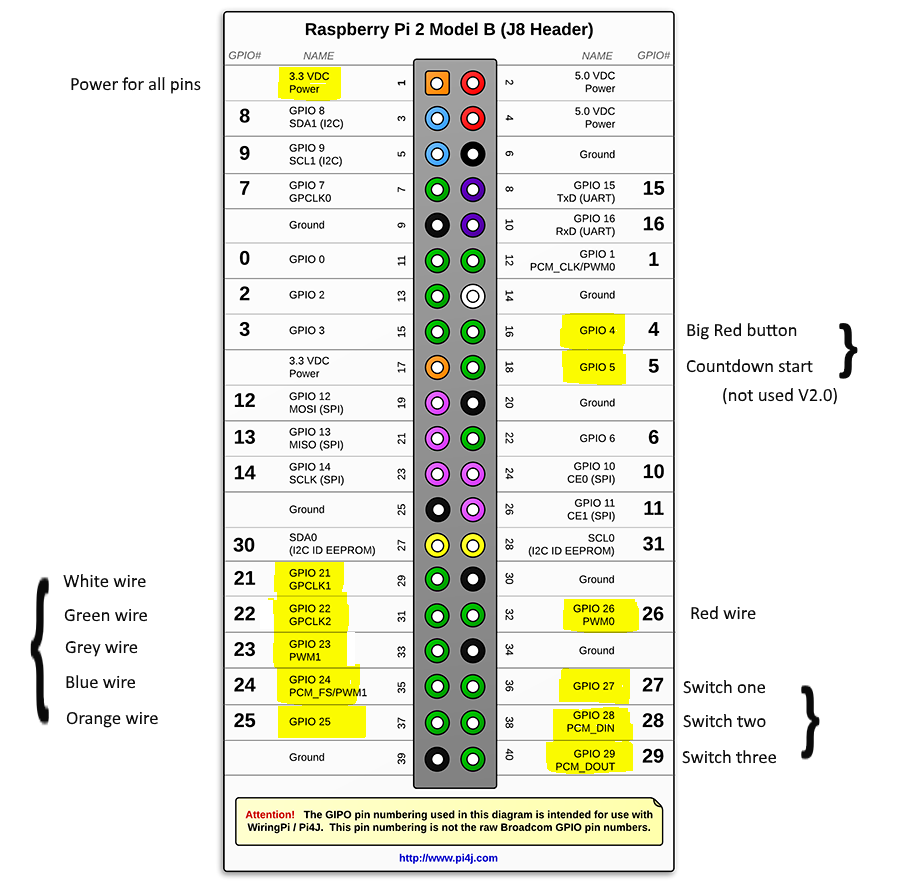

# README #

### What is this project for? ###

"The Device" emulates a bomb with a countdown timer and a set of wires which must be cut to "defuse" it. 
It is composed of a state machine which communicates with two Arduino Nano devices via a serial interface 
which also supplies power to the Nanos and the attached equipment.

One of these Nanos is 
handing the display of 4 RGB LEDs which are used to indicate a colour sequence which should be decrypted using
a printed manual in order to select a coloured wire to cut. 

The other Nano controls the countdown 
from an initial starting figure of what appears to be minutes and seconds. Note that when a incorrect 
wire is cut the time between digits changing on the display is halved speeding up the time left
to defuse the device.

This entertainment was originally developed for CDX 2017.
  
* Currently is version 2.0 of the device used at CDX 2018. Set the version number in the POM.

Version 2 loses the big red button which was used for adding minutes to the timer manually.
This is now controlled by a REST endpoint. Also the start countdown button is no longer connected.
Again this is now controlled by a REST endpoint. All REST endpoints are defined in the class core/StateMachine

## Processing ##

The Java controlling aplication is a finite state machine (The states are defined in the enumeration core/State).
The default state is RESTING, where the RGB LEDS flash with random colours and the clock display shows
a series of dashes. If this is how the front panel looks once switched on then everything is running
as expected.
The second state is COUNTDOWN where a set value is sent to the Nano which controls the time display and 
the countdown starts. If this number reaches -5 then the next state is EXPLODE (The -5 explode target is to 
create false hope in the players before detonation) when the clock display
shows the work DEAD and the RGB LED's flash red.
If the device is disarmed by cutting the wires in the correct order then the state is set to SAFE. Where
the word SAFE is shown on the clock display.

### How do I get set up? ###

- Summary of set up
  - Setup a CRON job on startup which runs the java controller program.
- Configuration
  - GPIO pins are setup in the Names classes, SwitchName, WireName and ButtonName enumerations.
  - Choice of 6 Colours for the wires is pulled from the CSV file in the resouces folder.
    This is loaded as an array and 6 contiguous values are selected.  The csv file was used to 
    print out the decryption manual which the players have to find to work out which wire to cut.
     
- Dependencies.
  - Defined in the POM file.

- Database configuration
  - None
- How to run tests
- Deployment instructions
  - mvn package

    This will create a jar file which contains all dependancies to run.
- running application
  
  - java -jar \<jar file name\>.jar
    
    Will start the java controller running.
- REST Endpoints
  - /device/start
  
    Starts the countdown for the device with a default 5 mins.   
  
  - /device/start30
  
    Starts the countdown for the device with the time available set to 30 mins.   
    
  - /device/explode
  
    Immediately sets the device to 'explode' (In case of cheating my the game players).   
  
  - /device/reset    
    
    Sets the device back to it's RESTING state.   

### Contribution guidelines ###

- Writing tests
- Code review
- Other guidelines

Connections
-----------

Raspberry Pi II pinouts used: 

### Who do I talk to? ###

* simon.king@stronans.com
